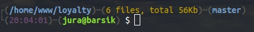
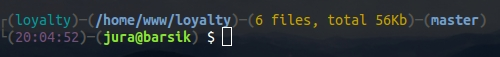
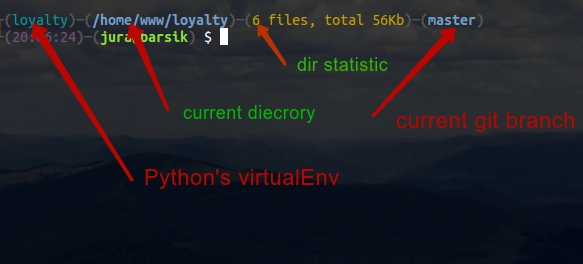

A little script to beautify PS1 in bash, for those people who spend most time in console. 

# Installation

Just clone this repo into any readable directory. E.g. ```~/.ps1-beautify```
```bash
    mkdir -p ~/.ps1-beautify
    git clone git@github.com:ygavenchuk/ps1-beautify.git ~/.ps1-beautify
```

Then add next line to the end of your ```.bashrc``` file

```bash
    [ -r "${HOME}/.ps1-beautify/main.sh" ] && source "${HOME}/.ps1-beautify/main.sh"
```

After that just run new terminal instance and `voi la`:




where 




# Management

## Rerun to previous value

Just say

```bash
    ps1_restore
```

## Manual start
```bash
    ps1_beautify
```

## Custom colors

To set up your own color schema define color variables just before including 
`ps1-beautify` script. Default color values are:

```bash
COLOR_BORDER=${COLOR_BORDER:-$COLOR_GRAY}
COLOR_CHROOT=${COLOR_CHROOT:-$COLOR_YELLOW}
COLOR_GIT=${COLOR_GIT:-$COLOR_BLUE}
COLOR_VENV=${COLOR_VENV:-$COLOR_CYAN}
COLOR_PATH=${COLOR_PATH:-$COLOR_BLUE}
COLOR_DIR_STAT=${COLOR_DIR_STAT:-$COLOR_YELLOW}
COLOR_TIME=${COLOR_TIME:-$COLOR_PURPLE}
COLOR_USER=${COLOR_USER:-$COLOR_GREEN}
COLOR_ROOT=${COLOR_ROOT:-$COLOR_RED}
COLOR_HOST=${COLOR_HOST:-$COLOR_GREEN}
```

List of some bash color and formatting options you may read [here](https://wiki.archlinux.org/index.php/Bash/Prompt_customization). 